# Hi! I'm Notwinner.

`GU A— B_:—-:_:—-:— C_ D_:- CM++ MW+ ULV?>+ MC? LC?>+/Lgo?>+/Ljs+@/Llua?>+/Lpy+@/Lts?>+/Lgle?>+ IO-:+ PGP? G:notwinner0 E- H_ !P TMLP+ RPG?>+ BK+ K? INTJ-A R! @/@!`
<!---
Notwinner0/Notwinner0 is a ✨ special ✨ repository because its `README.md` (this file) appears on your GitHub profile.
You can click the Preview link to take a look at your changes.
--->
